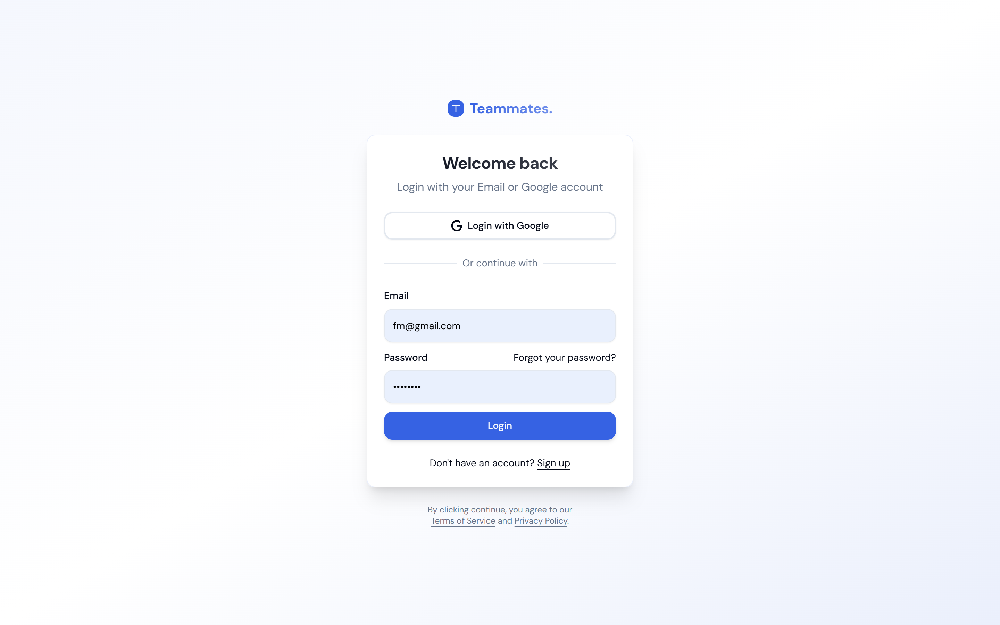
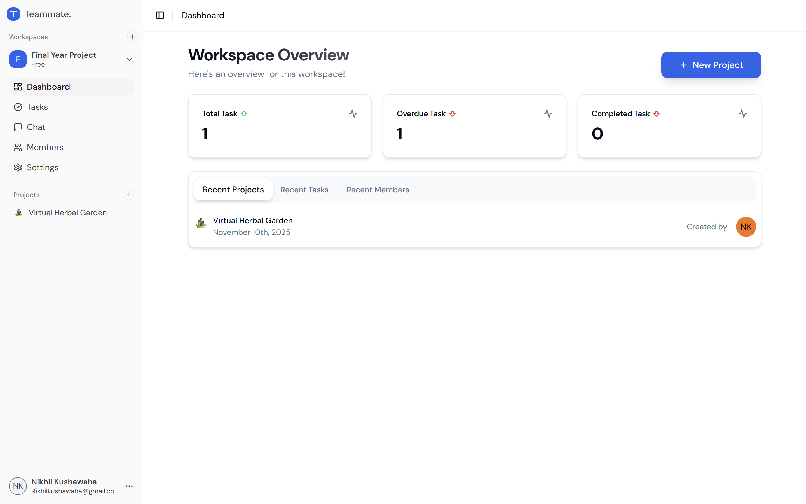
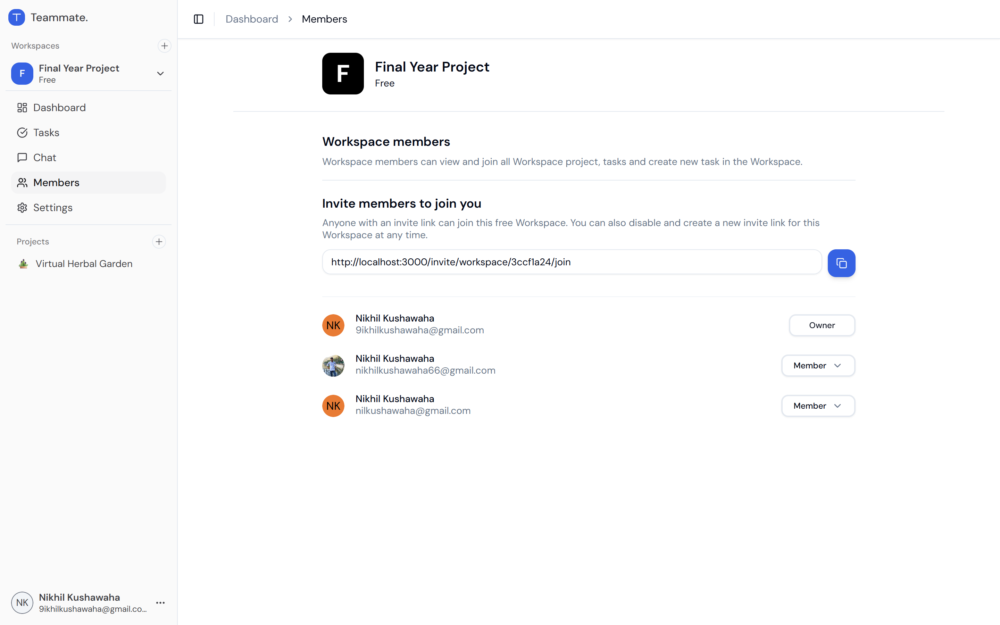
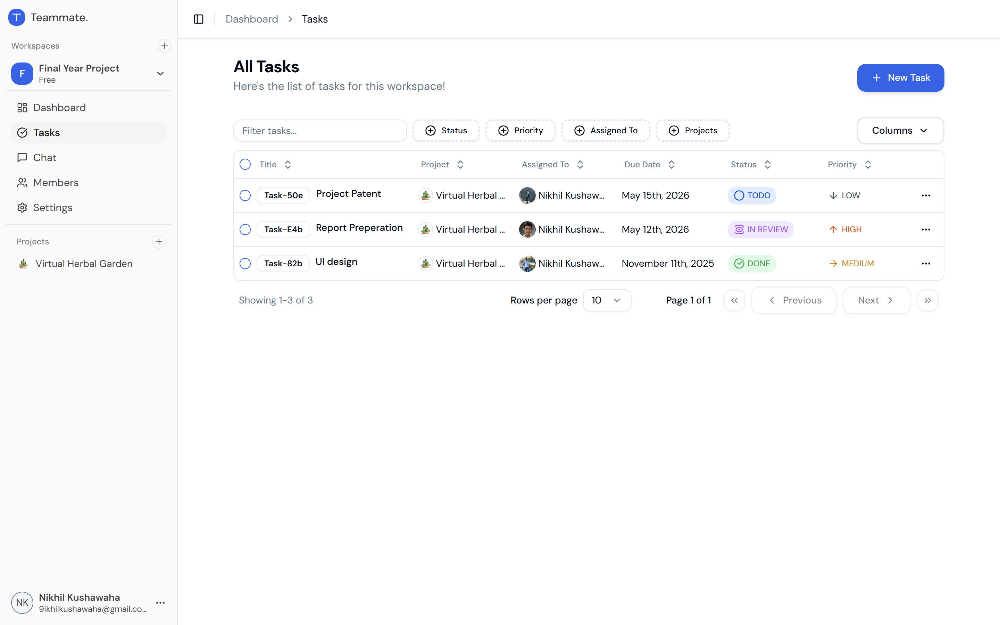

<div align="center">

# 🤝 Teammate

### A Modern Team Collaboration & Project Management Platform

**Teammate** is a full-stack web application that empowers teams to collaborate in real time — manage workspaces, organize projects, track tasks, and chat with colleagues, all in one place.

[](https://nodejs.org)
[](https://react.dev)
[](https://www.typescriptlang.org)
[](https://mongodb.com)
[](https://socket.io)

</div>

---

## 📋 Table of Contents

- [Overview](#-overview)
- [Screenshots](#-screenshots)
- [Features](#-features)
- [Tech Stack](#️-tech-stack)
- [Project Structure](#-project-structure)
- [Getting Started](#-getting-started)
- [Environment Variables](#-environment-variables)
- [API Reference](#-api-reference)
- [Role & Permission System](#-role--permission-system)
- [Deployment](#-deployment)
- [License](#-license)

---

## 🌟 Overview

Teammate is designed to help teams stay organized and connected. It follows a **monorepo architecture** with a clear separation between the frontend (`client`) and backend (`backend`), communicating via a RESTful API and real-time Socket.io events. Whether you're managing a small team or coordinating across multiple projects, Teammate gives you the structure and visibility to get things done.

---

## 📸 Screenshots

<table>
  <tr>
    <td align="center"><strong>🔐 Login Page</strong></td>
    <td align="center"><strong>📊 Dashboard</strong></td>
  </tr>
  <tr>
    <td></td>
    <td></td>
  </tr>
  <tr>
    <td align="center"><strong>👥 Members Management</strong></td>
    <td align="center"><strong>✅ Task Management</strong></td>
  </tr>
  <tr>
    <td></td>
    <td></td>
  </tr>
</table>

---

## ✨ Features

### 🔐 Authentication & Authorization
- **Email/Password Registration & Login** — Secure local authentication using hashed passwords (bcrypt) and server-side session management via `cookie-session`.
- **Google OAuth 2.0** — One-click sign-in with Google using Passport.js `passport-google-oauth20` strategy. Users are redirected to their workspace after successful login.
- **Session-Based Security** — Authenticated sessions with configurable expiry and secure, HTTP-only cookie flags for production environments.
- **Protected Routes** — All API endpoints (except auth) are guarded by an `isAuthenticated` middleware, ensuring only logged-in users can access data.

---

### 🏢 Workspace Management
- **Create Multiple Workspaces** — Users can create and belong to any number of workspaces, each with its own name, description, projects, members, and tasks.
- **Unique Invite Codes** — Each workspace is assigned an auto-generated unique invite code so new members can be onboarded easily.
- **Invite Code Reset** — Workspace owners can regenerate the invite code at any time to revoke previous links.
- **Workspace Analytics** — A dedicated analytics endpoint aggregates task and member data to power dashboard statistics (total tasks, completed, overdue, members, etc.).
- **Edit & Delete** — Owners can update workspace details or permanently delete a workspace (with permission enforcement).

---

### 📁 Project Management
- **Emoji-Tagged Projects** — Each project can have a custom emoji icon (defaults to 📊), making it easy to visually distinguish projects at a glance.
- **Full CRUD Operations** — Create, view, update, and delete projects within a workspace.
- **Project-Scoped Tasks** — Tasks are always scoped to a specific project within a workspace, keeping related work neatly organized.
- **Role-Gated Actions** — Creating, editing, and deleting projects is restricted based on the user's role (Owner/Admin only).

---

### ✅ Task Management
- **Rich Task Model** — Each task includes:
  - `taskCode` — A unique auto-generated identifier (e.g., `TASK-001`)
  - `title` & `description`
  - `status` — `BACKLOG`, `TODO`, `IN_PROGRESS`, `IN_REVIEW`, `DONE`
  - `priority` — `LOW`, `MEDIUM`, `HIGH`
  - `assignedTo` — Any workspace member
  - `dueDate`
  - `createdBy`
- **Advanced Filtering** — Fetch tasks filtered by `status`, `priority`, `assignedTo`, `keyword`, and `dueDate`, with server-side pagination support (`pageSize` / `pageNumber`).
- **Assign Members** — Assign tasks to specific workspace members and track ownership clearly.
- **Permission-Controlled Mutations** — Creating, editing, and deleting tasks are all gated by the workspace role system.

---

### 👥 Member Management
- **Invite to Workspace** — Members can join workspaces using invite codes.
- **View All Members** — Fetch a complete list of all workspace members along with their roles.
- **Change Member Roles** — Owners and Admins can promote or demote members between `OWNER`, `ADMIN`, and `MEMBER` roles.
- **Remove Members** — Owners can remove members from a workspace entirely.
- **Join Timestamp** — Each membership record tracks when the user joined the workspace.

---

### 💬 Real-Time Chat
- **Workspace Chat Rooms** — Each workspace has a dedicated chat room where all members can send and receive messages in real time.
- **Socket.io Powered** — Messages are broadcast instantly to all connected clients in the workspace room using Socket.io, with no page reload required.
- **Persistent Message History** — All messages are stored in MongoDB and fetched with pagination on chat load, so members never miss context.
- **Message Validation** — Messages are validated server-side (max 5,000 characters) before being saved and broadcast.

---

### 📈 Analytics & Dashboard
- **Workspace Analytics Endpoint** — Aggregates key metrics from the workspace including total tasks per status, overdue tasks, and member count.
- **Dashboard Overview** — The frontend dashboard consumes analytics to render a high-level view of project health and team activity.

---

### 🛡️ Role & Permission System
A robust, seeded role system controls what each member can do within a workspace:

| Permission | OWNER | ADMIN | MEMBER |
|---|:---:|:---:|:---:|
| Create / Edit / Delete Workspace | ✅ | ❌ | ❌ |
| Manage Workspace Settings | ✅ | ✅ | ❌ |
| Add Members | ✅ | ✅ | ❌ |
| Change Member Role | ✅ | ❌ | ❌ |
| Remove Members | ✅ | ❌ | ❌ |
| Create / Edit / Delete Projects | ✅ | ✅ | ❌ |
| Create / Edit Tasks | ✅ | ✅ | ✅ |
| Delete Tasks | ✅ | ✅ | ❌ |
| View Only | ✅ | ✅ | ✅ |

---

## 🛠️ Tech Stack

### Frontend (`/client`)

| Category | Technology |
|---|---|
| Framework | React 18 + Vite 6 |
| Language | TypeScript 5 |
| Styling | Tailwind CSS 3 |
| UI Components | Radix UI (Dialog, Dropdown, Tabs, Toast, Tooltip, etc.) |
| State Management | Zustand + TanStack React Query |
| Routing | React Router DOM v7 |
| Forms & Validation | React Hook Form + Zod |
| Real-time | Socket.io-client |
| Date Utilities | date-fns, react-day-picker |
| Table | TanStack React Table |
| Emoji Picker | emoji-mart |

### Backend (`/backend`)

| Category | Technology |
|---|---|
| Runtime | Node.js 20 |
| Framework | Express.js 4 |
| Language | TypeScript 5 |
| Database | MongoDB 8 (via Mongoose) |
| Authentication | Passport.js (Local + Google OAuth 2.0) |
| Session | cookie-session |
| Real-time | Socket.io 4 |
| Validation | Zod |
| Hashing | bcrypt |
| Dev Server | ts-node-dev |

### Infrastructure & DevOps

| Category | Technology |
|---|---|
| Containerization | Docker (multi-stage build) |
| Deployment | Render.com |
| Process Manager | dumb-init (in Docker) |
| Monorepo | npm Workspaces |
| Concurrent Dev | concurrently |

---

## 📁 Project Structure

```
teammate/
├── client/                    # React frontend (Vite + TypeScript)
│   ├── src/
│   │   ├── components/        # Reusable UI components
│   │   ├── context/           # React context providers
│   │   ├── hooks/             # Custom React hooks
│   │   ├── hoc/               # Higher-order components (e.g., auth guard)
│   │   ├── layout/            # Page layout wrappers
│   │   ├── page/              # Route-level pages
│   │   │   ├── auth/          # Login, Register pages
│   │   │   ├── invite/        # Workspace invite page
│   │   │   └── workspace/     # Dashboard, Tasks, Members, Chat, Settings
│   │   ├── routes/            # Route definitions
│   │   ├── types/             # TypeScript type definitions
│   │   └── lib/               # Utility libraries
│   └── screenshots/           # App screenshots
│
├── backend/                   # Node.js + Express backend (TypeScript)
│   └── src/
│       ├── config/            # App, DB, Passport, Socket configuration
│       ├── controllers/       # Route handler logic
│       ├── enums/             # Type-safe enums (roles, permissions, task status)
│       ├── middlewares/       # Auth guard, error handler, async wrapper
│       ├── models/            # Mongoose data models
│       ├── routes/            # Express routers
│       ├── seeders/           # Database seeders (roles)
│       ├── services/          # Business logic layer
│       ├── socket/            # Socket.io event handlers
│       ├── utils/             # Helpers (role guard, UUID, error classes)
│       └── validation/        # Zod request validation schemas
│
├── package.json               # Root monorepo scripts
└── render.yaml                # Render.com deployment config
```

---

## 🚀 Getting Started

### Prerequisites

- **Node.js** v20 or higher
- **npm** v9 or higher
- **MongoDB** — A running local or cloud (MongoDB Atlas) instance

### 1. Clone the Repository

```bash
git clone https://github.com/nikhilkushawaha/teammate.git
cd teammate
```

### 2. Install All Dependencies

```bash
npm run install:all
```

This installs dependencies for the root, `backend`, and `client` simultaneously.

### 3. Configure Environment Variables

Create a `.env` file in the `backend/` directory:

```env
NODE_ENV=development
PORT=5000
BASE_PATH=/api

MONGO_URI=mongodb://localhost:27017/teammate

SESSION_SECRET=your_super_secret_key
SESSION_EXPIRES_IN=86400000

GOOGLE_CLIENT_ID=your_google_client_id
GOOGLE_CLIENT_SECRET=your_google_client_secret
GOOGLE_CALLBACK_URL=http://localhost:5000/api/auth/google/callback

FRONTEND_ORIGIN=http://localhost:3000
FRONTEND_GOOGLE_CALLBACK_URL=http://localhost:3000/google/callback
```

### 4. Seed the Database

Seed the roles collection (required before first use):

```bash
npm run seed
```

### 5. Run in Development Mode

```bash
npm run dev
```

This uses `concurrently` to start both the backend (port `5000`) and the client dev server (port `3000`) simultaneously.

| Service | URL |
|---|---|
| Frontend | http://localhost:3000 |
| Backend API | http://localhost:5000/api |

---

## 🔑 Environment Variables

| Variable | Description | Required |
|---|---|:---:|
| `NODE_ENV` | `development` or `production` | ✅ |
| `PORT` | Backend server port (default: 5000) | ✅ |
| `BASE_PATH` | API base path (default: `/api`) | ✅ |
| `MONGO_URI` | MongoDB connection string | ✅ |
| `SESSION_SECRET` | Secret key for cookie-session | ✅ |
| `SESSION_EXPIRES_IN` | Session duration in milliseconds | ✅ |
| `GOOGLE_CLIENT_ID` | Google OAuth App Client ID | ✅ |
| `GOOGLE_CLIENT_SECRET` | Google OAuth App Client Secret | ✅ |
| `GOOGLE_CALLBACK_URL` | OAuth redirect URL (backend) | ✅ |
| `FRONTEND_ORIGIN` | Client app origin for CORS | ✅ |
| `FRONTEND_GOOGLE_CALLBACK_URL` | Client-side Google OAuth callback URL | ✅ |

---

## 📡 API Reference

All routes are prefixed with `/api`. Protected routes require an active session.

### Auth
| Method | Endpoint | Description |
|---|---|---|
| `POST` | `/api/auth/register` | Register a new user |
| `POST` | `/api/auth/login` | Login with email & password |
| `POST` | `/api/auth/logout` | Log out the current user |
| `GET` | `/api/auth/google` | Initiate Google OAuth login |
| `GET` | `/api/auth/google/callback` | Google OAuth callback |

### Workspace
| Method | Endpoint | Description |
|---|---|---|
| `POST` | `/api/workspace/create/new` | Create a new workspace |
| `GET` | `/api/workspace/all` | Get all workspaces the user belongs to |
| `GET` | `/api/workspace/:id` | Get workspace by ID |
| `PUT` | `/api/workspace/:id/update` | Update workspace details |
| `DELETE` | `/api/workspace/:id/delete` | Delete a workspace |
| `GET` | `/api/workspace/:id/members` | Get all members of a workspace |
| `GET` | `/api/workspace/:id/analytics` | Get workspace analytics |
| `POST` | `/api/workspace/:id/change-member-role` | Change a member's role |

### Project
| Method | Endpoint | Description |
|---|---|---|
| `POST` | `/api/project/:workspaceId/create` | Create a project |
| `GET` | `/api/project/:workspaceId/all` | List all projects in workspace |
| `GET` | `/api/project/:workspaceId/:id` | Get project details |
| `PUT` | `/api/project/:workspaceId/:id/update` | Update a project |
| `DELETE` | `/api/project/:workspaceId/:id/delete` | Delete a project |

### Task
| Method | Endpoint | Description |
|---|---|---|
| `POST` | `/api/task/:workspaceId/:projectId/create` | Create a task |
| `GET` | `/api/task/:workspaceId/all` | List tasks (with filters & pagination) |
| `GET` | `/api/task/:workspaceId/:projectId/:id` | Get task by ID |
| `PUT` | `/api/task/:workspaceId/:projectId/:id/update` | Update a task |
| `DELETE` | `/api/task/:workspaceId/:id/delete` | Delete a task |

### Chat
| Method | Endpoint | Description |
|---|---|---|
| `GET` | `/api/chat/:workspaceId/messages` | Get paginated chat history |
| `POST` | `/api/chat/:workspaceId/message` | Send a message (also emits Socket event) |

### Member
| Method | Endpoint | Description |
|---|---|---|
| `GET` | `/api/member/:workspaceId` | Get member info |

---

## 🛡️ Role & Permission System

The application uses a **seeded, database-driven role system** with three roles and fine-grained permissions:

- **`OWNER`** — Full control over the workspace (assigned to the workspace creator).
- **`ADMIN`** — Can manage projects, tasks, and settings, but cannot delete the workspace or change member roles.
- **`MEMBER`** — Can view everything and create/edit tasks, but has no administrative privileges.

Roles and their permissions are enforced server-side on every mutating request using the `roleGuard` utility, which checks the user's role permissions before allowing the operation to proceed.

---

## 🐳 Deployment

### Docker (Backend)

The backend includes a production-ready multi-stage `Dockerfile`:

```bash
# Build the image
docker build -t teammate-backend ./backend

# Run the container
docker run -p 8000:8000 --env-file ./backend/.env teammate-backend
```

### Render.com

The project includes a `render.yaml` for one-click deployment to [Render.com](https://render.com):

```yaml
services:
  - type: web
    name: teammate-backend
    env: node
    buildCommand: npm install && npm run build:backend
    startCommand: npm run start:backend
```

### Available npm Scripts

| Script | Description |
|---|---|
| `npm run dev` | Start both frontend and backend in development mode |
| `npm run dev:backend` | Start only the backend dev server |
| `npm run dev:client` | Start only the frontend dev server |
| `npm run build` | Build both frontend and backend for production |
| `npm run start` | Start the compiled backend in production mode |
| `npm run seed` | Seed the database with default roles |
| `npm run install:all` | Install all dependencies across the monorepo |
| `npm run lint` | Run ESLint on the client |

---

## 📜 License

This project is licensed under the **ISC License**.

---

<div align="center">
  Made with ❤️ by <a href="https://github.com/nikhilkushawaha">Nikhil Kushawaha</a>
</div>
